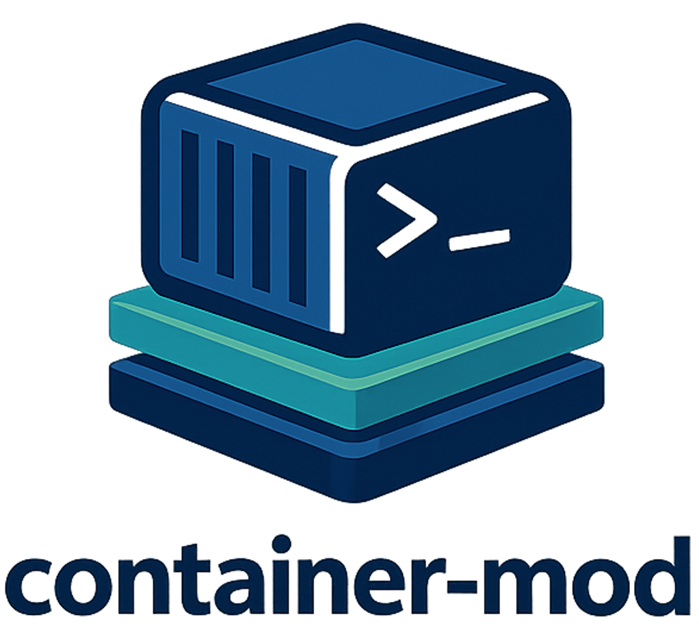

# container-mod



`container-mod` converts container images into HPC-friendly environment modules.
It can pull a container image, generate an Lmod modulefile, create wrapper
scripts for the programs exposed by that container, and optionally register a
Jupyter kernel. It supports both Lmod and Tcl modulefile output, with Lmod as
the default.

The project is aimed at both HPC administrators publishing shared software
stacks and users building personal container-backed modules in home space.

## What It Produces

For each container URI or local image, `container-mod` can generate:

- A `.sif` image, unless you point it at an existing local image
- A modulefile such as `app/version.lua` for Lmod or `app/version` for Tcl
- Wrapper scripts such as `app/version/bin/<program>`
- An optional Jupyter kernel entry

The wrappers let users run containerized commands as ordinary shell commands
after loading the module.

## How It Works

`container-mod` uses the text files in [`repos/`](/Users/yucheng/Documents/GitHub/container-mod/repos) as its application metadata database. Each app file defines:

- `Description`: short help text shown in the modulefile
- `Home Page`: upstream project URL
- `Programs`: comma-separated executables to wrap

Optional `version(...)` lines can be added to record the source URI for
specific versions.

Example app metadata:

```text
Description: Bowtie 2 is an ultrafast and memory-efficient tool for aligning sequencing reads to long reference sequences.
Home Page: https://github.com/BenLangmead/bowtie2
Programs: bowtie2,bowtie2-build,bowtie2-inspect

version("2.5.4", uri="docker://quay.io/biocontainers/bowtie2:2.5.4--h7071971_4")
version("2.5.1", uri="docker://quay.io/biocontainers/bowtie2:2.5.1--py310h8d7afc0_0")
```

If an app is missing from `repos/`, the script will prompt for the description,
homepage, and program list and create a new entry.

## Requirements

- Bash
  The script is compatible with the macOS system Bash and newer GNU Bash.
- A container runtime
  `singularity` or `apptainer` must be available directly or loadable through `module load`.
- Lmod
  Required when generating Lua modulefiles.
- Tcl Environment Modules
  Required when generating Tcl modulefiles.
- Standard Unix tools
  `sed`, `awk`, `grep`, `find`, `mktemp`, and `realpath`.
- For `-j/--jupyter`
  The container must include `python` and `ipykernel`.

## Repository Layout

- [`container-mod`](/Users/yucheng/Documents/GitHub/container-mod/container-mod): main script
- [`repos/`](/Users/yucheng/Documents/GitHub/container-mod/repos): app metadata and executable lists
- [`profiles/`](/Users/yucheng/Documents/GitHub/container-mod/profiles): cluster-specific output locations
- [`templates/module_template.lua`](/Users/yucheng/Documents/GitHub/container-mod/templates/module_template.lua): base Lmod template
- [`templates/module_template.tcl`](/Users/yucheng/Documents/GitHub/container-mod/templates/module_template.tcl): base Tcl template
- [`jupyter_kernel.json`](/Users/yucheng/Documents/GitHub/container-mod/jupyter_kernel.json): Jupyter kernel template

## Profiles

Profiles define shared output locations for images, wrappers, and modules. This
repo currently includes:

- `biocontainers`
- `biocontainers_rocky9`
- `ngc`
- `ngc_rocky9`
- `course_jupyter`
- `gis`

The profile files live in [`profiles/`](/Users/yucheng/Documents/GitHub/container-mod/profiles) and typically define:

- `MOD_EXISTING_DIR_DEF`
- `PUBLIC_IMAGEDIR`
- `PUBLIC_EXECUTABLE_DIR`

You can also create personal profile overrides in `~/container-apps/profiles`.

Profile variables map to runtime behavior like this:

- `MOD_EXISTING_DIR_DEF`: existing shared module tree to search when reusing a prior modulefile
- `PUBLIC_IMAGEDIR`: destination for pulled container images in profile-backed mode
- `PUBLIC_EXECUTABLE_DIR`: shared wrapper root used when rendering new modulefiles

When a profile is active, the script still writes newly generated modulefiles to
`<OUTDIR>/incomplete` unless you are in personal mode. This lets you stage and
review generated modules before moving them into a shared production tree.

### Creating a Custom Profile

Create a plain shell file in `~/container-apps/profiles/<name>` or add one under
[`profiles/`](/Users/yucheng/Documents/GitHub/container-mod/profiles). A minimal
profile looks like:

```bash
MOD_EXISTING_DIR_DEF="/cluster/example/modules"
PUBLIC_IMAGEDIR="/cluster/example/images"
PUBLIC_EXECUTABLE_DIR="/cluster/example/tools"
```

Then use it with:

```bash
./container-mod pipe --profile <name> docker://quay.io/biocontainers/seqkit:2.10.0--h9ee0642_0
```

### `--profile` vs `--personal`

Use `--profile` when you want cluster-specific shared locations and existing
module trees defined by an administrator or site convention.

Use `-p/--personal` when you want everything placed under your home directory:

- images in `~/container-apps/images`
- wrappers in `~/container-apps/tools`
- metadata in `~/container-apps/repos`
- modules in `~/privatemodules`

If you do not pass `--profile`, the script defaults to personal mode.

## Usage

```bash
container-mod <subcommand> [options] <URI-or-image> [...]
```

Subcommands:

- `pull`: pull a remote image into the configured image directory
- `module`: generate the modulefile
- `exec`: generate wrapper scripts
- `pipe`: run `pull`, `module`, and `exec` in sequence

Options:

- `-d, --dir DIR`: base output directory for generated public artifacts
- `-f, --force`: overwrite existing generated files
- `-m, --module-dir DIR`: search this directory for existing modulefiles to repurpose
- `-s, --module-system SYS`: choose `lmod` or `tcl`
- `-u, --update`: prepend a `version(...)` entry to the app metadata file
- `-p, --personal`: write into personal directories under `~/container-apps` and `~/privatemodules`
- `-t, --tcl`: shortcut for `--module-system tcl`
- `--profile NAME`: load a named profile from [`profiles/`](/Users/yucheng/Documents/GitHub/container-mod/profiles) or `~/container-apps/profiles`
- `-j, --jupyter`: create a Jupyter kernel after the main workflow completes
- `-h, --help`: show built-in help
- `-l, --list`: list available profiles

If you do not pass `--profile`, the script defaults to personal mode. If you do
not pass `--module-system`, the script generates Lmod modulefiles.

## Output Locations

Personal mode writes to:

- `~/container-apps/images`
- `~/container-apps/tools`
- `~/container-apps/repos`
- `~/privatemodules`
- `~/.local/share/jupyter/kernels` for Jupyter kernels

Profile-backed or shared mode writes to:

- Images: `PUBLIC_IMAGEDIR`
- Wrappers: `PUBLIC_EXECUTABLE_DIR`
- Existing-module lookup: `MOD_EXISTING_DIR_DEF` or `-m`
- New modulefiles: `<OUTDIR>/incomplete`
- New wrappers when not using personal mode: `<OUTDIR>/executables`
- New Jupyter kernels when not using personal mode: `<OUTDIR>/kernels`

The default `OUTDIR` is the current directory.

## Common Workflows

Pull an image and generate both the module and wrappers:

```bash
./container-mod pipe --profile biocontainers \
  docker://quay.io/biocontainers/vcftools:0.1.16--h9a82719_5
```

Create a personal module from a public Docker image:

```bash
./container-mod pipe -p docker://staphb/bowtie2:2.5.4
module load use.own
module load bowtie2/2.5.4
bowtie2 --help
```

Generate a Tcl modulefile instead of the default Lua modulefile:

```bash
./container-mod module --module-system tcl -p docker://staphb/bowtie2:2.5.4
module load bowtie2/2.5.4
```

Generate artifacts from a local image without re-pulling:

```bash
./container-mod pipe -p /path/to/my/image.sif
```

Register a new version in the repo metadata while pulling:

```bash
./container-mod pull --profile biocontainers -u \
  docker://quay.io/biocontainers/fastqc:0.12.1--hdfd78af_0
```

Create a Jupyter kernel after generating wrappers:

```bash
./container-mod pipe -p -j docker://tensorflow/tensorflow:2.18.0-jupyter
```

List available profiles:

```bash
./container-mod --list
```

## Local Image Behavior

When the input is an existing local `.sif` file:

- The image is not copied or moved
- The script prompts for app name and version
- Generated wrappers point back to the original image path

This is useful for one-off local workflows and testing custom images.

## Module Generation Behavior

When generating an Lmod modulefile, the script first looks for the newest
existing modulefile for the same app in the configured module search path. If
one is found, it repurposes that file for the new version. Otherwise, it
renders a new modulefile from
[`templates/module_template.lua`](/Users/yucheng/Documents/GitHub/container-mod/templates/module_template.lua).

When generating a Tcl modulefile, the script renders a fresh modulefile from
[`templates/module_template.tcl`](/Users/yucheng/Documents/GitHub/container-mod/templates/module_template.tcl).

The generated modulefile:

- advertises description, homepage, and registry info
- prepends the generated wrapper directory to `PATH`
- uses the syntax of the selected module system

## Wrapper Generation Behavior

The `Programs:` field in each app metadata file controls wrapper generation.
For each listed executable, the script:

1. Checks whether the command exists inside the container
2. Creates a wrapper under `app/version/bin/`
3. Executes the command through `singularity exec` or `apptainer exec`
4. Adds `--nv` or `--rocm` automatically when GPUs are detected

Commands listed in `Programs:` but not found in the container are skipped with a
warning.

## Jupyter Support

With `-j/--jupyter`, `container-mod` creates a kernel entry named
`<app>-<version>`.

The container must contain:

- `python`
- `ipykernel`

If `ipykernel` is missing, kernel generation stops and the script prints a
remediation hint.

## Notes and Limitations

- The quality of generated wrappers depends on the accuracy of the `Programs:`
  field in the app metadata file.
- Some URIs use custom name mapping in the script, for example `qiime2`,
  `parabricks`, and `nsightsys`.
- `--update` modifies the matching app metadata file by inserting a new
  `version(...)` line for the pulled image.
- The script creates new app metadata interactively when an app is not already
  present in the repo database.

## Development

Basic validation:

```bash
bash -n container-mod
./container-mod --help
```

If you change module generation behavior, also review
[`templates/module_template.lua`](/Users/yucheng/Documents/GitHub/container-mod/templates/module_template.lua)
and
[`templates/module_template.tcl`](/Users/yucheng/Documents/GitHub/container-mod/templates/module_template.tcl)
and the profile files in
[`profiles/`](/Users/yucheng/Documents/GitHub/container-mod/profiles).

## License

This project is released under the MIT License. See
[`LICENSE`](/Users/yucheng/Documents/GitHub/container-mod/LICENSE).

## Contributor


Yucheng Zhang  
Research Technology, Tufts Technology Services  
Tufts University  
yucheng.zhang@tufts.edu
